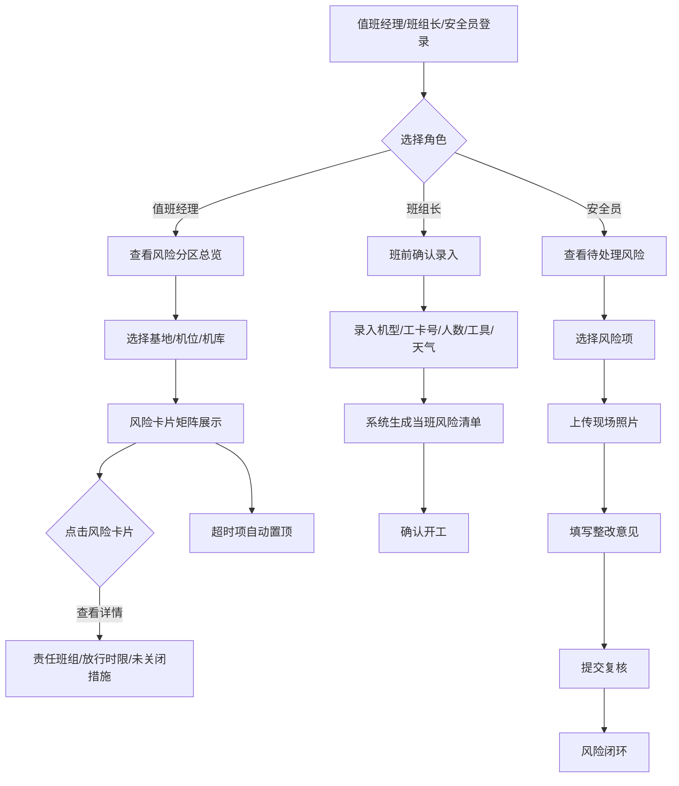

## 1. 产品概述

面向航空维修单位生产控制中心的 Web 风险看板系统，集中展示机库、停机坪和航线维修的现场安全状态，实现风险可视化、班前确认和闭环跟踪的全流程管理。

- 核心目标：让值班经理、班组长和安全员在晨会、交接班时快速掌握全场风险态势，提升安全管理效率
- 目标用户：值班经理、班组长、安全员

## 2. 核心功能

### 2.1 用户角色

| 角色 | 核心权限 |
|------|----------|
| 值班经理 | 查看风险分区总览、筛选基地/机位/机库、查看风险详情、监控超时未处理项 |
| 班组长 | 班前确认录入（机型、工卡号、作业人数、特殊工具、天气）、查看当班风险清单 |
| 安全员 | 填写现场照片、整改意见、复核结果，闭环处理风险项 |

### 2.2 功能模块

1. **风险分区总览**：区域筛选、风险卡片矩阵、红黄绿等级标识、风险详情弹窗
2. **班前确认入口**：班前信息录入表单、当班风险清单自动生成
3. **闭环跟踪**：风险处理表单、超时自动置顶、复核状态跟踪

### 2.3 页面详情

| 页面名称 | 模块名称 | 功能描述 |
|----------|----------|----------|
| 风险看板主页 | 顶部状态栏 | 实时时间、班次信息、值班经理、风险统计概览 |
| 风险看板主页 | 区域筛选栏 | 基地选择、机位/机库切换、维修区域筛选 |
| 风险看板主页 | 风险卡片矩阵 | 高空作业、通电测试、燃油作业、顶升、拖机等风险卡片，按红黄绿分级显示 |
| 风险看板主页 | 风险详情弹窗 | 责任班组、放行时限、未关闭措施、历史记录 |
| 风险看板主页 | 超时预警区 | 超时未处理项自动置顶展示 |
| 班前确认页 | 信息录入表单 | 机型、工卡号、作业人数、特殊工具、天气条件录入 |
| 班前确认页 | 风险清单 | 根据录入信息自动生成当班风险清单 |
| 闭环跟踪页 | 风险处理列表 | 待处理、处理中、已复核状态分类展示 |
| 闭环跟踪页 | 处理表单 | 现场照片上传、整改意见填写、复核结果录入 |

## 3. 核心流程

### 3.1 主流程描述
1. 值班经理登录系统 → 选择基地/机位/机库 → 查看风险分区总览 → 点击风险卡片查看详情 → 跟踪超时未处理项
2. 班组长进入班前确认 → 录入机型、工卡号、作业人数、特殊工具、天气 → 系统生成当班风险清单 → 确认开工
3. 安全员查看待处理风险 → 上传现场照片 → 填写整改意见 → 提交复核 → 风险闭环

### 3.2 Mermaid 流程图

## 4. 用户界面设计

### 4.1 设计风格
- **主色调**：深蓝色（#0F2747）作为主背景，搭配工业感深色系
- **风险色**：红色（#DC2626）- 高风险、黄色（#F59E0B）- 中风险、绿色（#10B981）- 低风险
- **辅助色**：蓝色（#3B82F6）- 信息标识、灰色（#64748B）- 次要信息
- **按钮风格**：直角微圆角，硬朗工业风，带有微妙边框和悬浮效果
- **字体**：主标题使用 Space Grotesk，正文使用 Inter，数字使用等宽字体 JetBrains Mono
- **布局风格**：网格仪表盘布局，卡片式信息聚合，数据密集型展示
- **图标风格**：线性图标，统一 2px 线宽，工业感 SVG 图标

### 4.2 页面设计概述

| 页面名称 | 模块名称 | UI 元素 |
|----------|----------|---------|
| 风险看板主页 | 顶部状态栏 | 深色背景条、实时时钟、班次标签、风险数量统计徽章、渐变色 |
| 风险看板主页 | 区域筛选栏 | 下拉选择器、Tab 切换、激活态高亮边框、图标 |
| 风险看板主页 | 风险卡片矩阵 | 3 列网格布局、彩色边框（红/黄/绿）、风险等级徽标、脉冲动画、悬停放大效果 |
| 风险看板主页 | 风险详情弹窗 | 半透明遮罩、滑入动画、分段信息展示、时间轴 |
| 风险看板主页 | 超时预警区 | 置顶红色横幅、闪烁提示、倒计时显示 |
| 班前确认页 | 信息录入表单 | 分组表单、下拉选择、数字输入、多选标签、表单分步引导 |
| 班前确认页 | 风险清单 | 列表视图、风险色条、自动动画生成 |
| 闭环跟踪页 | 风险处理列表 | 状态标签、时间戳、筛选标签、拖拽排序（可选） |
| 闭环跟踪页 | 处理表单 | 图片上传预览区、富文本输入、步骤指示器 |

### 4.3 响应式
- 桌面优先设计，适配 1920×1080 及以上监控大屏
- 中等屏幕自适应卡片数量，保持信息密度
- 移动端简化布局，保留核心风险查看功能

### 4.4 动效设计
- 页面加载：卡片依次淡入上浮（staggered animation）
- 风险等级：高风险卡片带有轻微脉冲呼吸动画
- 弹窗：背景遮罩淡入 + 内容滑入效果
- 数据更新：数字变化时使用滚动数字动画
- 悬停：卡片微放大 + 阴影加深
