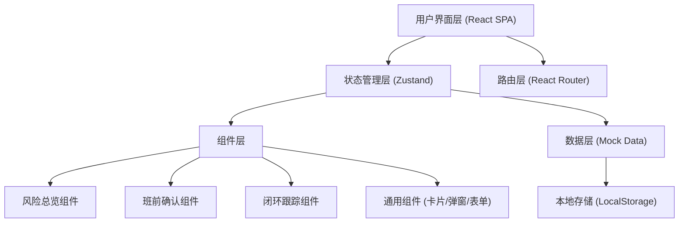
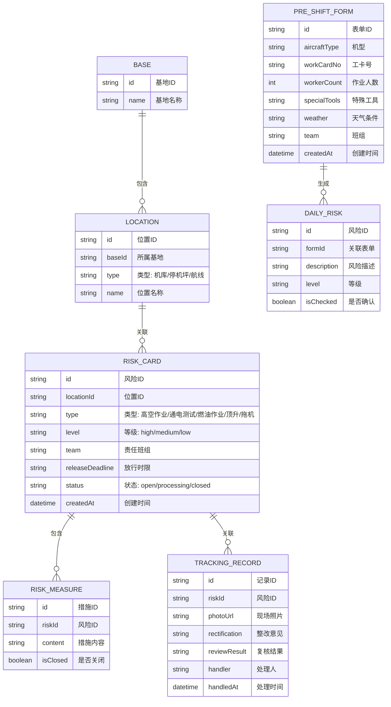

## 1. 架构设计



## 2. 技术描述

- **前端框架**：React@18 + TypeScript
- **构建工具**：Vite@6
- **样式方案**：TailwindCSS@3
- **状态管理**：Zustand（轻量级状态管理）
- **路由方案**：React Router@6
- **图标库**：Lucide React
- **数据方案**：前端 Mock 数据 + LocalStorage 持久化
- **动画方案**：CSS Animation + Framer Motion（可选）

## 3. 路由定义

| 路由 | 用途 |
|------|------|
| / | 风险看板主页（风险分区总览 + 超时预警） |
| /pre-shift | 班前确认入口 |
| /tracking | 闭环跟踪 |

## 4. 数据模型

### 4.1 数据模型定义



### 4.2 TypeScript 类型定义

```typescript
type RiskLevel = 'high' | 'medium' | 'low';
type LocationType = 'hangar' | 'apron' | 'line';
type RiskType = 'high_altitude' | 'power_test' | 'fuel_operation' | 'jacking' | 'towing';
type RiskStatus = 'open' | 'processing' | 'closed';

interface Base {
  id: string;
  name: string;
}

interface Location {
  id: string;
  baseId: string;
  type: LocationType;
  name: string;
}

interface RiskCard {
  id: string;
  locationId: string;
  type: RiskType;
  level: RiskLevel;
  team: string;
  releaseDeadline: string;
  status: RiskStatus;
  createdAt: string;
  isOverdue?: boolean;
}

interface RiskMeasure {
  id: string;
  riskId: string;
  content: string;
  isClosed: boolean;
}

interface TrackingRecord {
  id: string;
  riskId: string;
  photoUrl?: string;
  rectification: string;
  reviewResult: string;
  handler: string;
  handledAt: string;
}

interface PreShiftForm {
  id: string;
  aircraftType: string;
  workCardNo: string;
  workerCount: number;
  specialTools: string[];
  weather: string;
  team: string;
  createdAt: string;
}

interface DailyRisk {
  id: string;
  formId: string;
  description: string;
  level: RiskLevel;
  isChecked: boolean;
}
```

## 5. 组件结构

```
src/
├── components/
│   ├── layout/
│   │   ├── Header.tsx          # 顶部状态栏
│   │   └── Sidebar.tsx         # 侧边导航
│   ├── dashboard/
│   │   ├── LocationFilter.tsx  # 区域筛选栏
│   │   ├── RiskCard.tsx        # 风险卡片
│   │   ├── RiskGrid.tsx        # 风险卡片矩阵
│   │   ├── RiskDetailModal.tsx # 风险详情弹窗
│   │   └── OverdueBanner.tsx   # 超时预警区
│   ├── preshift/
│   │   ├── PreShiftForm.tsx    # 班前信息录入表单
│   │   └── DailyRiskList.tsx   # 当班风险清单
│   ├── tracking/
│   │   ├── RiskTrackingList.tsx # 风险处理列表
│   │   └── TrackingForm.tsx    # 处理表单
│   └── common/
│       ├── Badge.tsx           # 徽章组件
│       ├── Button.tsx          # 按钮组件
│       └── Modal.tsx           # 弹窗组件
├── pages/
│   ├── Dashboard.tsx           # 风险看板主页
│   ├── PreShift.tsx            # 班前确认页
│   └── Tracking.tsx            # 闭环跟踪页
├── store/
│   └── useRiskStore.ts         # Zustand 状态管理
├── data/
│   └── mockData.ts             # Mock 数据
├── types/
│   └── index.ts                # 类型定义
└── utils/
    └── helpers.ts              # 工具函数
```
